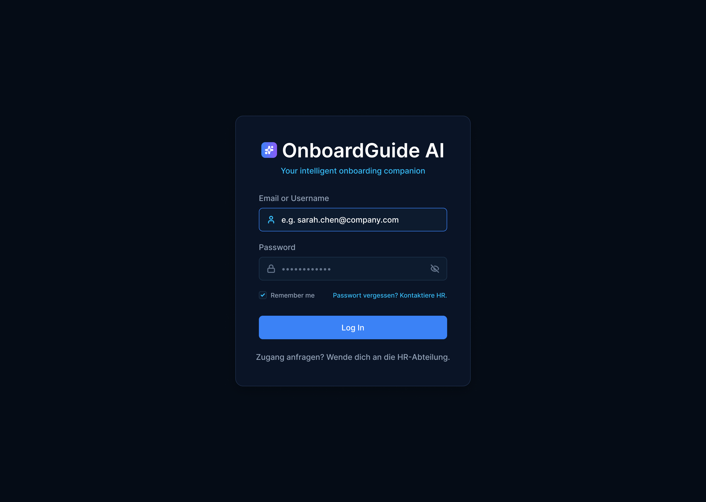
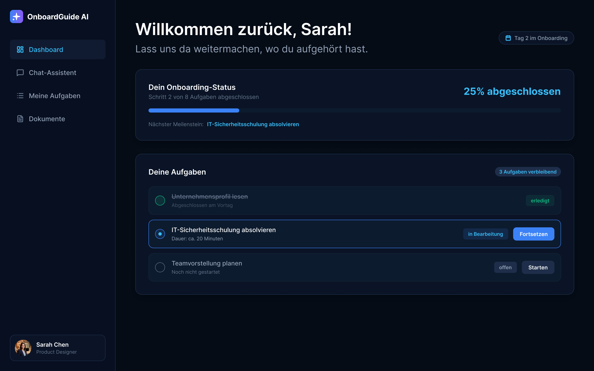
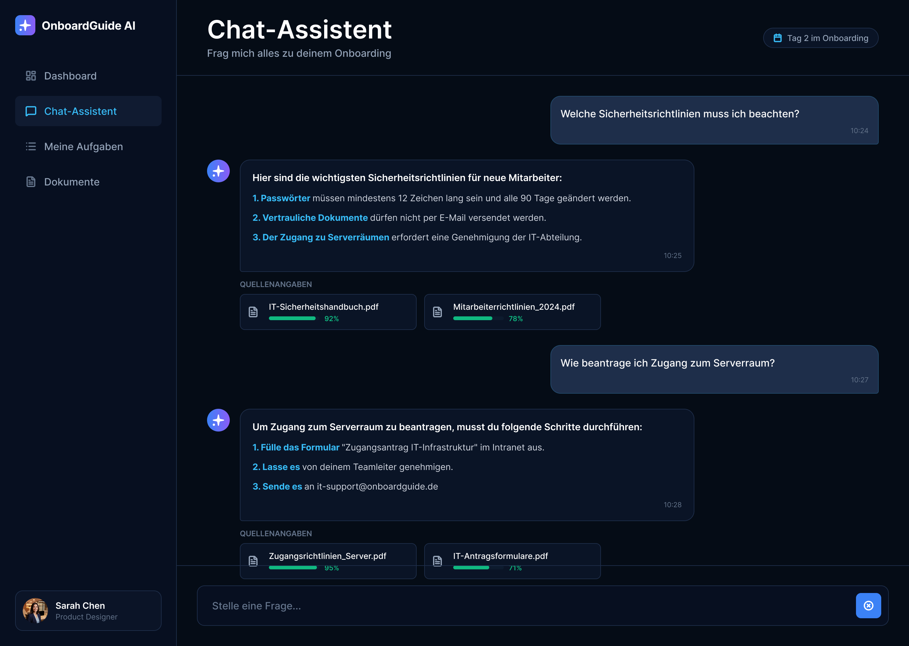
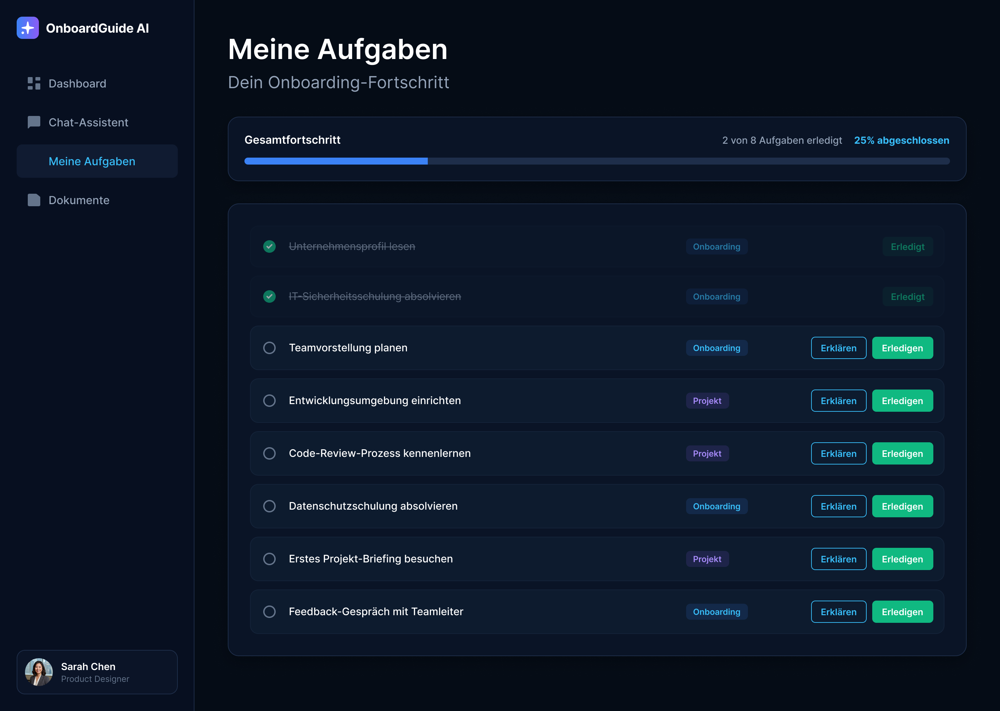
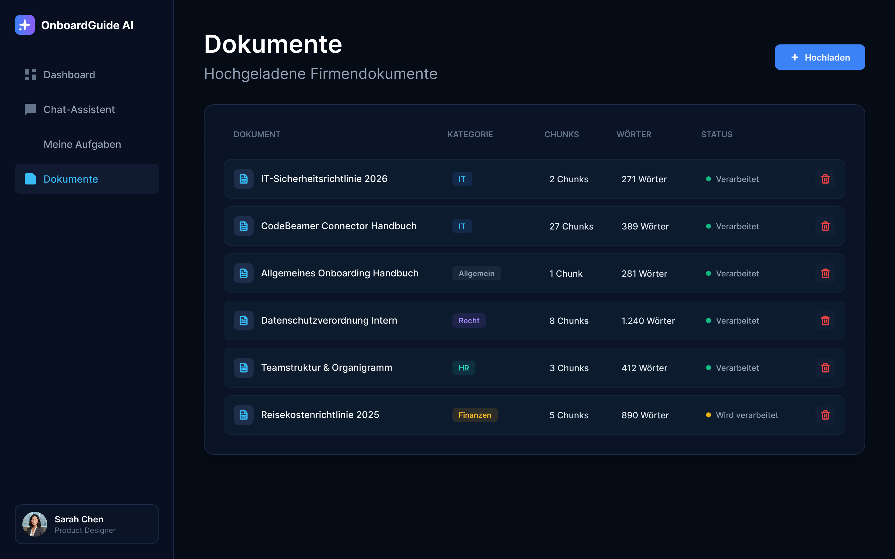
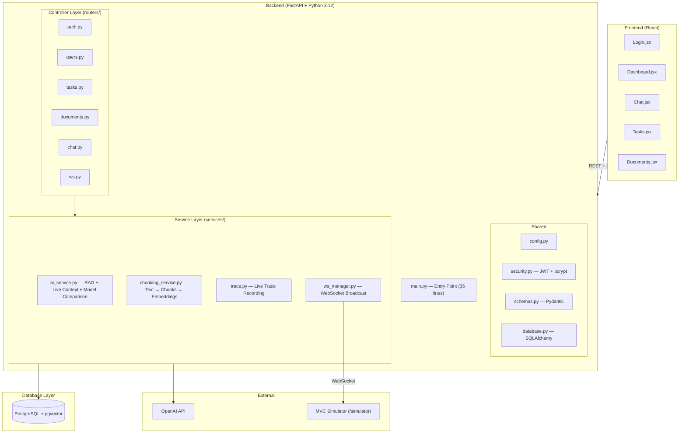
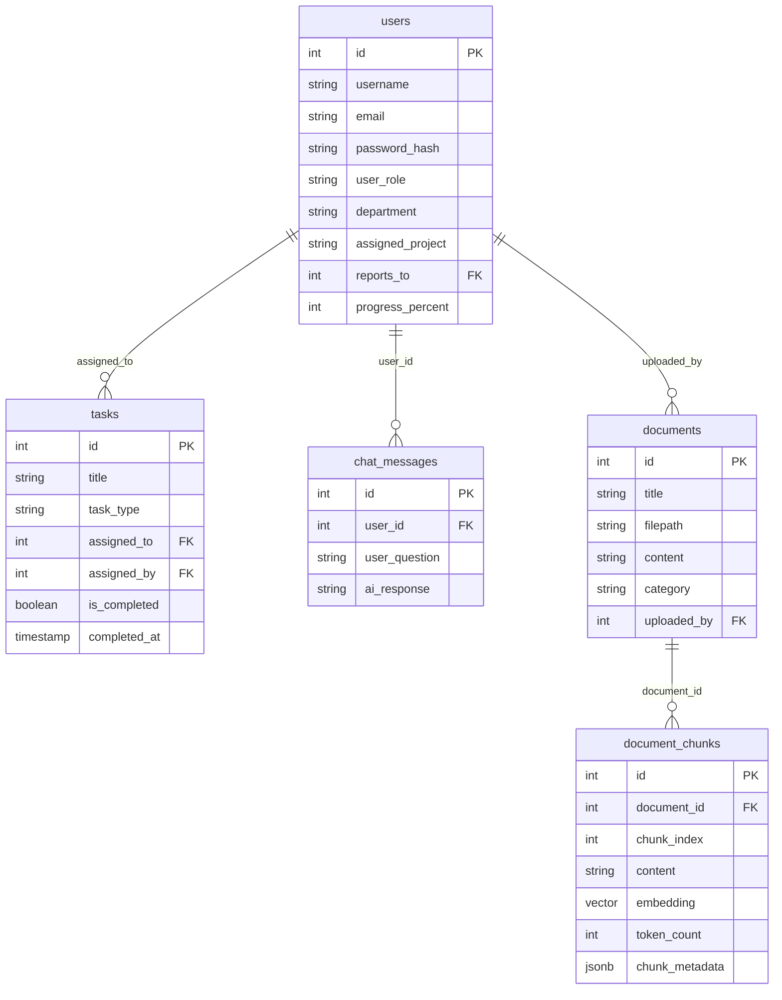

# OnboardGuide AI 🤖

> *From Latin "onboarding" (Einarbeitung) and German "Leitfaden" (guide) — OnboardGuide AI is an intelligent HR onboarding assistant that meets new employees where they are: answering real questions from real company documents, not generic tutorials.*

Upload company policies, project plans, and handbooks. OnboardGuide extracts relevant context, builds a personal knowledge base per role, and lets employees chat with an AI that knows exactly what documents they are allowed to see — and what tasks they still have open.

---

## What it does

| | |
|---|---|
| **JWT Authentication** | Secure login — every action is tied to a real identity |
| **RAG with pgvector** | Documents are chunked, embedded and stored as vectors for precise retrieval |
| **Live Context** | Open tasks and team progress are injected into every AI prompt |
| **Role-based access** | Verwaltung / Leader / Mitarbeiter each see only their permitted documents |
| **Model comparison** | gpt-4o-mini vs gpt-5-mini — response time, tokens, cost side by side |
| **Live Trace Simulator** | Every API request animates the MVC data flow automatically via WebSocket |
| **Structured Outputs** | Task explainer returns guaranteed JSON: summary + steps + tips |
| **React Frontend** | Full web app with Login, Dashboard, Chat, Tasks and Documents pages |

---

## Screenshots

### Login


### Dashboard


### Chat


### Tasks


### Dokumente

---

## Tech Stack

| Component | Technology |
|---|---|
| Backend | FastAPI + Python 3.12 |
| Frontend | React 18 + React Router |
| Database | PostgreSQL 18 + pgvector 0.8.3 |
| ORM | SQLAlchemy |
| Validation | Pydantic v2 |
| Auth | JWT (python-jose) + bcrypt |
| LLM | OpenAI gpt-4o-mini / gpt-5-mini |
| Embeddings | text-embedding-3-small (1536 dim) |
| Real-time | WebSocket (uvicorn[standard]) |
| Testing | pytest + 37 tests |

---

## Architecture



---

## Database



---

## Getting Started

### Prerequisites

- Python 3.12
- Node.js 18+
- PostgreSQL 18 with pgvector extension

### Backend

```bash
# Clone repository
git clone https://github.com/mhmood88hz-cloud/onboardguide-ai.git
cd onboardguide-ai

# Install dependencies
pip install -r requirements.txt

# Configure environment
cp .env.example .env
# → Fill in DB_USER, DB_PASSWORD, DB_HOST, DB_NAME,
#   OPENAI_API_KEY, JWT_SECRET_KEY, ADMIN_TOKEN

# Enable pgvector in PostgreSQL
# In pgAdmin: CREATE EXTENSION IF NOT EXISTS vector;

# Apply database migrations (creates schema incl. multi-tenant tables)
alembic upgrade head

# Start server
uvicorn main:app --reload
```

### Docker (all services)

```bash
cp .env.example .env   # fill in OPENAI_API_KEY, JWT_SECRET_KEY, ADMIN_TOKEN
docker compose up --build
```

| URL | Description |
|---|---|
| `http://localhost:3000` | React Frontend (nginx) |
| `http://localhost:8000` | FastAPI Backend |
| `localhost:5432` | Postgres + pgvector |

The backend container runs `alembic upgrade head` automatically before starting.

### Frontend

```bash
cd frontend
npm install
npm start
```

| URL | Description |
|---|---|
| `http://localhost:8000` | FastAPI Backend |
| `http://localhost:8000/docs` | Swagger UI |
| `http://localhost:8000/simulator` | MVC Live Trace Simulator |
| `http://localhost:3000` | React Frontend |

---

## Environment Variables

```env
DB_USER=postgres
DB_PASSWORD=your-password
DB_HOST=localhost
DB_PORT=5432
DB_NAME=onboardguide_db
OPENAI_API_KEY=sk-...
OPENAI_MODEL=gpt-4o-mini
JWT_SECRET_KEY=your-long-secret-key
JWT_ALGORITHM=HS256
JWT_EXPIRE_MINUTES=480
ADMIN_TOKEN=your-admin-token
CHUNK_SIZE=400
CHUNK_OVERLAP=50
TOP_K_CHUNKS=3

# Cloudflare R2 (S3-compatible) — persistent storage for uploaded documents
# and extracted PDF images. Required in production: Render's filesystem is
# wiped on every redeploy/restart, so local disk storage loses all uploads.
# If unset, the app falls back to local disk under uploads/ (fine for local
# dev/tests, NOT fine for any real deployment).
R2_ACCOUNT_ID=your-cloudflare-account-id
R2_ACCESS_KEY_ID=your-r2-access-key-id
R2_SECRET_ACCESS_KEY=your-r2-secret-access-key
R2_BUCKET_NAME=onboardguide-documents
R2_ENDPOINT_URL=https://your-account-id.eu.r2.cloudflarestorage.com
```

---

## API Endpoints

### Auth

| Method | Endpoint | Auth | Description |
|---|---|---|---|
| `POST` | `/api/auth/signup` | – | Self-serve: creates a new Organization + its first Verwaltung user → JWT Token |
| `POST` | `/api/auth/login` | – | Login → JWT Token |
| `POST` | `/api/auth/register` | JWT + Verwaltung | Register new employee |
| `POST` | `/api/auth/change-password` | JWT | Change own password |
| `POST` | `/api/auth/reset-password` | JWT + Verwaltung | Reset any user's password |

### Users

| Method | Endpoint | Auth | Description |
|---|---|---|---|
| `GET` | `/api/users` | JWT + Verwaltung | List all users |
| `DELETE` | `/api/users/{id}` | JWT + Verwaltung | Delete user (cascade) |

### Documents

| Method | Endpoint | Auth | Description |
|---|---|---|---|
| `POST` | `/api/documents/upload` | JWT + Verwaltung | Upload PDF/TXT → chunk → embed |
| `GET` | `/api/documents` | JWT | List documents (role-filtered) |

### Tasks

| Method | Endpoint | Auth | Description |
|---|---|---|---|
| `POST` | `/api/tasks` | – | Create task |
| `GET` | `/api/tasks` | – | Get user tasks |
| `PUT` | `/api/tasks/{id}/complete` | JWT | Complete task (RBAC check) |
| `GET` | `/api/tasks/leader/progress` | – | Team progress |

### Chat

| Method | Endpoint | Auth | Description |
|---|---|---|---|
| `POST` | `/api/chat/ask` | JWT | RAG chat with similarity scores |
| `GET` | `/api/chat/history` | JWT | Load last 20 messages |
| `POST` | `/api/chat/tasks/{id}/explain` | JWT | Task explainer (Structured Outputs) |

### System

| Method | Endpoint | Auth | Description |
|---|---|---|---|
| `GET` | `/` | – | Health check |
| `GET` | `/simulator` | – | MVC Live Trace Simulator |
| `WS` | `/ws/trace` | – | WebSocket trace stream |

---

## The Three RAG Pillars + Live Context

```
Pillar A — Conversation History
  Last 5 messages from DB → model remembers context

Pillar B — Dynamic Context Injection
  System prompt with role/department/project → personalized answers

Pillar C — Vector RAG (pgvector)
  Question → embedding → cosine search → top-3 chunks → model

Live Context — DB Data (never leaves the network)
  Open tasks + team progress injected into every prompt
```

---

## Role Concept

| Role | Permissions |
|---|---|
| **Verwaltung** | All documents, register/delete users, upload, reset passwords, see all users |
| **Leader** | Own department docs, manage team tasks, see team progress, reset team passwords |
| **Mitarbeiter** | Own documents, own tasks, chat, change own password |

---

## Billing

No Stripe. A company signs up via `/signup` (or `POST /api/auth/signup`)
and gets a `trial` organization that's active by default. Payment is
arranged out-of-band (invoice or direct debit), then the operator
activates or deactivates the org via an owner-only API protected by the
`ADMIN_TOKEN` header — no customer ever sees these endpoints:

```bash
# List all organizations and their status
curl http://localhost:8000/api/platform/organizations \
  -H "x-admin-token: $ADMIN_TOKEN"

# Activate (optionally with an expiry date; omit active_until for unlimited)
curl -X POST http://localhost:8000/api/platform/organizations/{id}/activate \
  -H "x-admin-token: $ADMIN_TOKEN" -H "Content-Type: application/json" \
  -d '{"active_until": "2026-12-31T00:00:00"}'

# Deactivate immediately (e.g. invoice unpaid)
curl -X POST http://localhost:8000/api/platform/organizations/{id}/deactivate \
  -H "x-admin-token: $ADMIN_TOKEN"
```

`activate` also auto-generates an invoice PDF (`app/services/invoice_service.py`,
`12 EUR/employee` at the time of activation, sequential number `RE-<year>-<seq>`,
stored in R2) that the owner can review and send manually — never emailed
automatically. Optional `billing_contact_name`/`billing_address` in the
activate request are persisted on the `Organization` and reused by future
invoices. No VAT is shown (§ 19 UStG / Kleinunternehmerregelung) unless
`OWNER_VAT_ID` is set. List/download from the Admin UI or:

```bash
curl http://localhost:8000/api/platform/organizations/{id}/invoices \
  -H "x-admin-token: $ADMIN_TOKEN"

curl http://localhost:8000/api/platform/organizations/{id}/invoices/{invoice_id}/pdf \
  -H "x-admin-token: $ADMIN_TOKEN" -o invoice.pdf
```

Every authenticated request checks `Organization.is_active` and
`active_until` (`app/security.py::organization_has_access`) and returns
`402 Payment Required` once access lapses — no cron job needed.

---

## Testing

```bash
# Run all 37 tests
python -m pytest tests/ -v --timeout=30

# Run specific test file
python -m pytest tests/test_auth.py -v
```

| File | Tests | Coverage |
|---|---|---|
| `test_auth.py` | 11 | Login, Register, Change/Reset Password |
| `test_tasks.py` | 7 | Create, Complete, RBAC |
| `test_documents.py` | 5 | Upload, Role-filtered access |
| `test_chat.py` | 9 | RAG Chat, Task Explainer, History |
| **Total** | **37** | **All passing ✅** |

---

## Privacy & Sensitive Data

OnboardGuide AI sends document chunks to the OpenAI API for embedding and completion. This is suitable for general company knowledge (policies, handbooks, guidelines).

For sensitive data that must not leave the internal network:

```
Planned: is_sensitive flag on documents table
→ sensitive=true  → local model (ollama + sentence-transformers)
→ sensitive=false → OpenAI API (current)
```

**Live Context** (tasks, team progress) never leaves the backend — it is injected server-side into the prompt and never sent to external APIs as raw data.

---

## Roadmap

### ✅ Done

- [x] MVC modularization (784 → 35 lines main.py)
- [x] Admin token authentication (first implementation)
- [x] JWT authentication — replaced admin token after security review
  - Admin token: anyone who knew the token could act as any user
  - JWT: requires real login, cryptographically signed, role verified
- [x] Role-based access control (Verwaltung / Leader / Mitarbeiter)
- [x] RAG upgraded to pgvector + chunking (text-embedding-3-small)
- [x] Live Context — tasks and team data injected into RAG prompt
- [x] Model comparison with metrics (time, tokens, cost)
- [x] Live Trace Simulator with WebSocket (auto-animation)
- [x] Structured Outputs (task explainer)
- [x] Password change & reset endpoints
- [x] Chat history — saved and loaded on page open
- [x] React Frontend — Login, Dashboard, Chat, Tasks, Documents
- [x] Leader dashboard — team view, task creation, password reset
- [x] Verwaltung dashboard — all users, delete, reset passwords
- [x] pytest — 37 automated tests, all passing

- [x] Multi-tenant data model (`Organization` + `organization_id` on every tenant-scoped table, self-serve `/api/auth/signup` with a matching Signup page)
- [x] Alembic database migrations
- [x] Docker containerization (backend, frontend, pgvector Postgres via `docker-compose.yml`)
- [x] Apple-HIG-inspired glass UI (`frontend/src/theme.css`) applied across all pages
- [x] Manual billing activation (no Stripe) — `POST /api/platform/organizations/{id}/activate|deactivate`, protected by `ADMIN_TOKEN`, with an optional expiry date. See "Billing" below.
- [x] Persistent document/image storage via Cloudflare R2 (`app/services/storage_service.py`) — replaces local disk, which is wiped on every Render redeploy/restart. Falls back to local disk automatically when R2 env vars are unset (local dev/tests).
- [x] Rate limiting on `/api/auth/login` (10/min) and `/api/auth/signup` (5/min) per IP via `slowapi`, to blunt brute-force/credential-stuffing attempts.

### 🔜 Planned

- [ ] Local model support (ollama + sentence-transformers) for sensitive documents
- [ ] Azure OpenAI private deployment for GDPR compliance
- [ ] Legal pages (Impressum, Datenschutzerklärung, AGB)
- [ ] Transactional email (welcome mail, self-service "forgot password")
- [ ] Error tracking / uptime monitoring for backend + frontend
- [ ] Production deployment (Railway / Render + Neon.tech), DNS under `onboardguide.leadspeak.de`

---

## About

**1:1 GenAI Mentoring Program**
Mentor: Fares | Developer: Mahmood Al-Djabboori